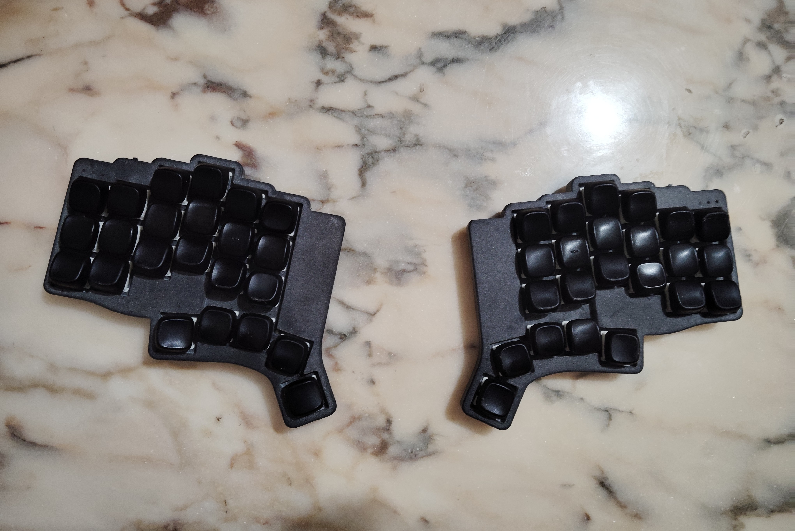
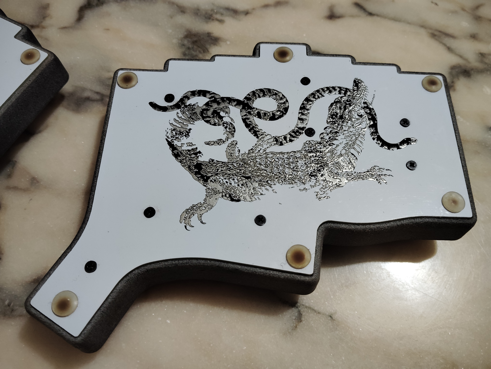

<h1 align="center">ITEMX2</h1>

***

ITEMX est un clavier en deux parties de 46 touches fonctionnant avec [ZMK](https://github.com/zmkfirmware/zmk) et utilisant une SEEED XIAO BLE comme microcontrolleur. Il a été conçu avec [Ergogen](https://github.com/ergogen/ergogen), [FreeCad](https://www.freecad.org/) et [KiCad](https://www.kicad.org/).

C’est la quatrième itération d’un projet dont le but est de créer un clavier ergonomique ayant 5 touches de pouces par main et utilisant une répartition des caractères adaptés du [BÉPO](https://bepo.fr/wiki/Accueil).

Pour plus de détail sur le projet, voir ici : [https://github.com/MartinDrillon](https://github.com/MartinDrillon/ITEMX)
